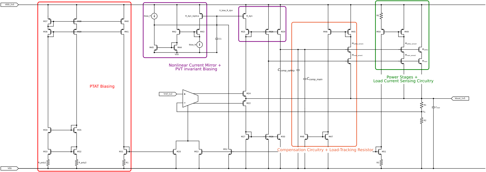
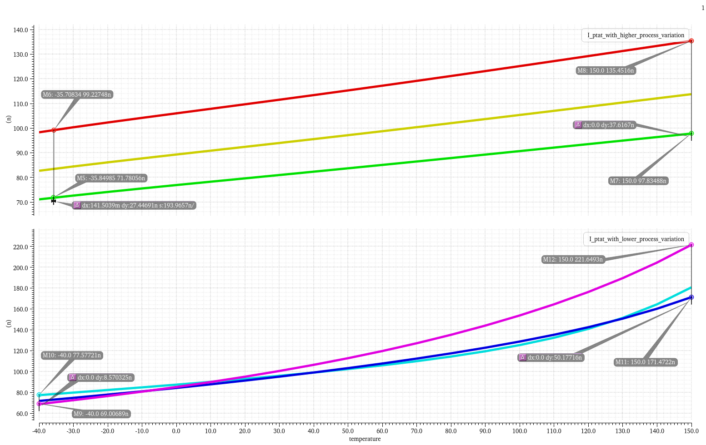

:stem: latexmath
:sectnums:

== Chapter 4: Implementation

=== Dual Loop Architecture

To be able to improve on both static precision and dynamic performance, a dual loop architecture was chosen:
The outer loop was optimized for high DC gain through a double-cascoded symmetrical OTA with an input differential pair sized for low mismatch. [During steady‑state operation, the high gain of the symmetrical outer OTA dominates the CCII inner feedback loop, allowing the 1.5 V regulator to achieve under 2% precision in MC300 simulations.]
To maintain optimal transient performance, high DC gain and current efficiency, a biasing circuitry with a PTAT component and an adaptive component that increases with load current has been used.

.1V5 Voltage Regulator with Dual Loop Architecture

=== Inner OTA Design and Slew Rate Enhancement
For the Inner OTA a second generation current conveyor (CCII) was chosen. The design mirrors the bipolar variant of Fabre [A Precise Macromodel for Second
Generation Current Conveyors Alain Fabre] [Translinear current conveyors implementation Fabre], using the same translinear loop as its core. This design was chosen over the Barthelemy variant [Barthelemy H (1997) Low-output-impedance class AB bipolar voltage buffer] for its better quiescent current control over PVT. [insert plot of quiescent current variation for both topologies]

The CCII has its Y voltage input is driven by the symmetrical outer OTA, while its X current input is directly connected to the regulator output. Owing to its simplicity, class AB behavior, and current feedback operation, the CCII inner loop can be optimized for wide bandwidth and high slew rate, allowing it to take over the system response during transient events. Furthermore, a nonlinear PMOS current mirror that exploits the transition from the triode region to saturation of a resistor-emulating PMOS [4] has been used to further increase the positive slew rate of the inner OTA, ensuring 221mV undershoots in full load jumps between 100nA and 10mA over PVT. R_dyn is biased at the edge of the triode region in steady state, but when a sufficiently high current flows through M24 during a transient undershoot event, R_dyn will enter the saturation region to reach an operating point with a higher drain current, but with the same VGS . This mirrors gliding up the Y-axis of the ID/VDS graph of a MOSFET. A slew rate comparison between a current conveyor with a classical and a nonlinear current mirror is shown in Fig. 2. The regulation loop response to a load jump from 100nA to 10mA with the two aforementioned current mirrors is also shown in Fig. 3.

== Outer OTA Design and Loop Stability
The outer OTA is a double-cascoded symmetrical OTA with an input differential pair sized for low mismatch biased in the subthreshold region. The design of the outer OTA was optimized for high DC gain, which is essential for achieving high precision in the voltage regulator. The symmetrical architecture of the OTA helps to minimize offset while the double-cascoding technique allows for a significant increase in gain without sacrificing bandwidth. The single-stage topology was chosen to minimize the quiescent current and the number of poles in the system, thus improving stability margins.

=== PTAT Current reference
The PTAT biasing circuitry is based on the classical ΔVGS PTAT core. The extra resistor R_poly2 has a PTAT behaviour, just like R_ploy1, but it has a greater variance with temperature. In this way, the output PTAT bias current has a lower process corner dependence.

.PTAT Current References Comparison

=== Adaptive Biasing
The adaptive biasing current keeps the regulator's efficiency high at minimum loads and increases the Unity Gain frequency, and Stability margins at higher loads. It also allows the outer loop gain to surpass 80dB DC loop gain above 200 uA and 90dB above 2mA.
With the help of a variable resistor, implemented through M48, that generates a load-tracking zero, stability is ensured for loads between 1u and 10mA and 0 and 10nF,  load current and capacitance, respectively. 

