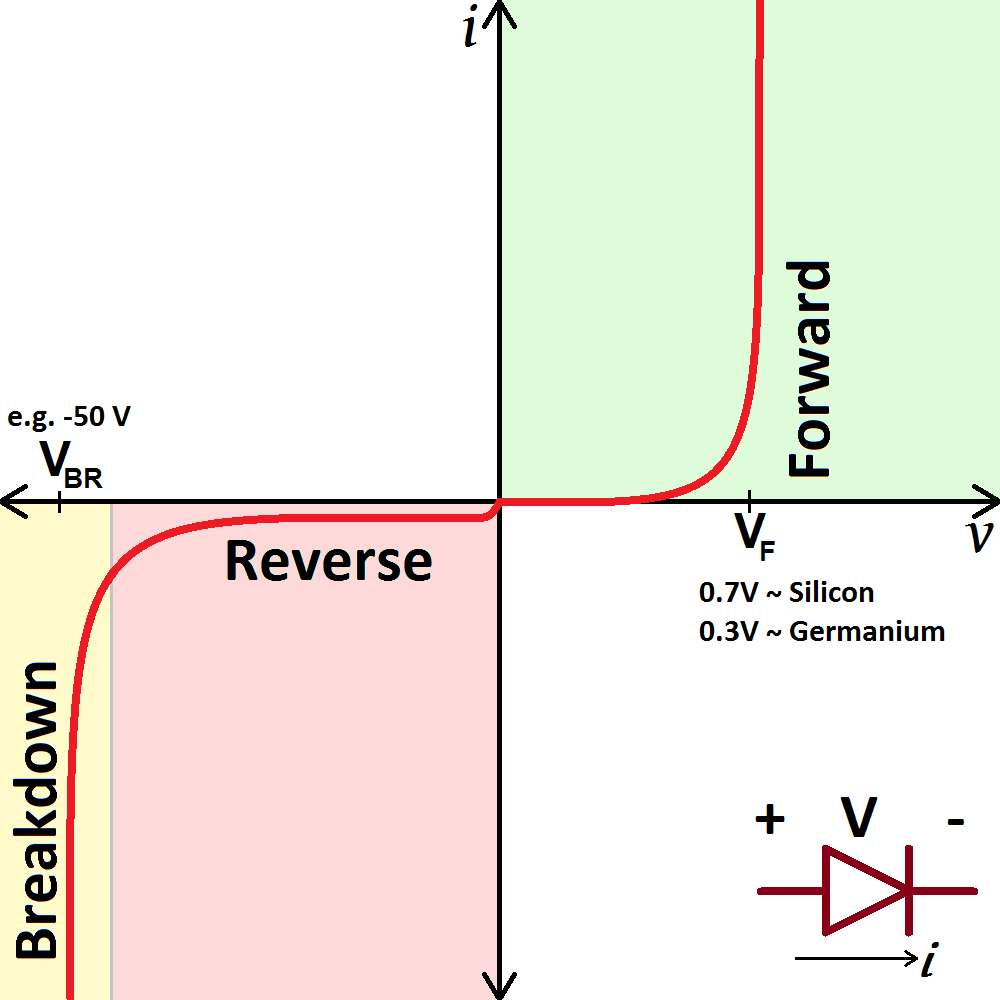

= Lucrare de finalizare a studiilor
Petru-Rares Moldovan
// Aceasta este o directivă care activează suportul pentru ecuații matematice:
:stem: latexmath

== 1. Fundamentare teoretică

Acesta este textul normal. Puteți scrie cu *îngroșat (bold)* sau cu _cursiv (italic)_. 
Aceaste este o lucrare de dizertatie care va rupe gura târgului. Acesta este un sistem de scriere a documentelor în format text, care poate fi convertit în PDF, HTML sau alte formate. Este foarte util pentru a crea documente tehnice, cum ar fi lucrări de cercetare, manuale sau prezentări.

=== 1.1 Subtitlu

Iată cum introduci o imagine. Textul din paranteze pătrate devine automat explicația (caption) imaginii:

.Caracteristica statică de transfer

=== 1.1.2 Ecuații, tabele, figuri

Iată o ecuație matematică scrisă în sintaxă LaTeX. Blocul `stem` o va randa corect:

[stem]
++++
\frac{V_1}{R} = I_1
++++

Și iată cum se construiește un tabel avansat. Punctul de deasupra reprezintă titlul tabelului:

.Exemplu de tabel
[options="header", width="50%", align ="center"]
|===
| Nr. crt. | R [kΩ] | I [mA]

| 1
| 10
| 2,40

| 2
| 5,1
| 4,70
|===