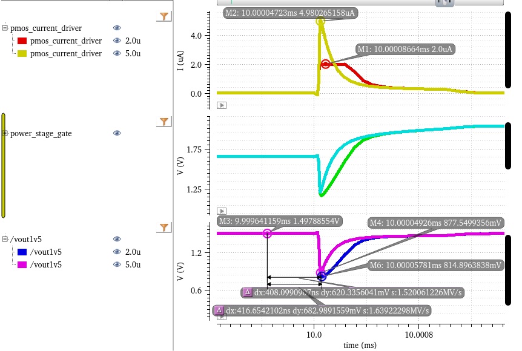
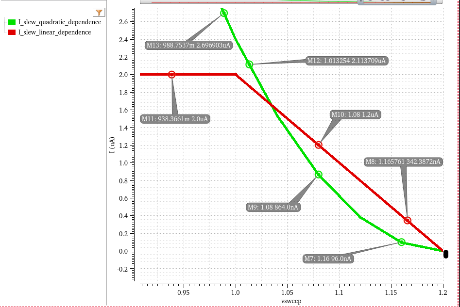
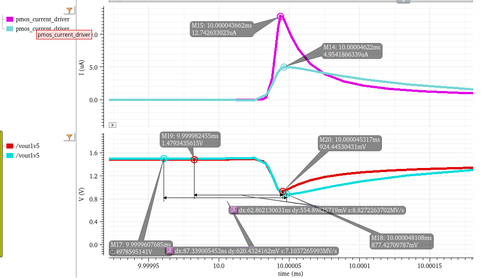

:stem: latexmath
:sectnums:
:eqnums: all
:plusm: &#177;
:xrefstyle: short

== Chapter 3: Theoretical Fundamentals

=== Precision Calculation

Parameter Vout_static
Typical 1.5 {plusm} 3% -> min: 1.455V, max: 1.545V

V~ref_ideal~ = 1.2V

// to double check headings
=== Transient Response and Slew Rate
// to add details about automotive
The Slew Rate directly impacts the transient response of the voltage regulator, which is crucial for maintaining the output voltage within acceptable limits under varying load conditions. In automotive applications, where power efficiency and reliability are paramount, optimizing the Slew Rate can lead to improved performance and reduced power consumption.

Usually, for a step in the output load current, from 0 to a maximum value stem:[I_{load\_max}], the maximum output voltage variation stem:[\Delta V_{out\_max}] can be expressed as: 

[stem]
++++
\Delta V_{out\_max} = (\frac{1}{BW_{cl}} + \frac{\Delta V_{gate} \cdot C_{gate}}{I_{SR}})\cdot \frac{I_{load\_max}}{C_{load}}
++++

At the first moment of the current step, the control loop has not had time to react. The extra current demand, stem:[\Delta I_{load\_max}], is supplied entirely by the output capacitor, stem:[C_{load}]. This causes the output voltage to start dropping at a rate:  stem:[\frac{\Delta I_{load\_max}}{C_{load}}]. The output voltage will stop dropping at the instant when the power stage supplies exactly the same value of the demanded load current. Until then, the loop will try to react and restore the output voltage, but the response time is limited by the loop bandwidth, stem:[BW_{cl}]. During this time, the output voltage will have dropped by an amount: stem:[\frac{\Delta I_{load\_max}}{C_{load} \cdot BW_{cl}}].
After the loop starts to react, the gate voltage of the pass transistor will begin to change. The time it takes for the gate voltage to change by the required amount such as to supply the demanded load current can be written as: stem:[t_{sr} = \frac{\Delta V_{gate}}{SR_{Gate}} = \frac{\Delta V_{gate} \cdot C_{gate}}{I_{SR}}].

As can be seen from the equation the loop bandwidth and the slew rate of the OTA play an essential role in shaping the transient response of the voltage regulator. 

If we consider the NMOS voltage regulator as a two-pole system with the dominant pole at the power stage's node and the second pole at the output node, the worst case stability scenario is at low load current and high output capacitance. The value of the gate capacitor should be chosen such that stability at the lowest required load current and maximum load capacitance is ensured. From this design constraint, there is an effective upper bound on the possible bandwidth of the control loop.

The other parameter that we are free to tune is the Slew Rate of the OTA. Indeed, increasing the Slew Rate will reduce the time it takes for the gate voltage to change, thus improving the transient response of the regulator. 

<<loadJump_ota_model_linear_transientResponse_2u_vs_5u_Islew>> shows the difference in transient response between two OTA models with different Slew Rates. The OTA with a higher Slew Rate (5uA/V) shows a faster recovery to the nominal output voltage after a load jump compared to the OTA with a lower Slew Rate (2uA/V). This demonstrates the importance of optimizing the Slew Rate in the design of voltage regulators, especially in applications where rapid load changes are expected.

.Load jump response comparison between two OTA models with different Slew Rates
[#loadJump_ota_model_linear_transientResponse_2u_vs_5u_Islew]

However, we must keep in mind the conditions under which eq. (1) was derived and remains valid. The equation assumes that the output current exhibits both a hard saturation on the bias current and a linear dependence on the input differential voltage. Therefore, increasing the Slew Rate requires more current from the OTA, which leads to increased power consumption. Therefore, there is a trade-off between transient response and power efficiency that must be carefully balanced in the design of the voltage regulator, for class-A type OTAs.

For class AB OTAs, which typically exhibit a nonlinear relationship between the output current and the input differential voltage, the situation differs. In these devices, the slew rate can be enhanced without significantly raising the quiescent current, improving the transient response without a substantial power penalty. <<dc_sweep_ota_model_linear_vs_quadratic>> illustrates the differing output current behaviors of a linear and a quadratic OTA model. The linear model demonstrates hard saturation at the 2 &micro;A bias current when the output voltage drops below 1 V. Conversely, the quadratic model initially presents a lower slope, resulting in a lower transconductance for minor voltage deviations, but this slope increases rapidly. Consequently, its output current overtakes that of the linear model for voltages below 1.025 V. (It should be noted that no current saturation was incorporated into this simplified quadratic model). Therefore, boosting an OTA's slew rate via a nonlinear stage can improve transient behavior and power efficiency, even if the unity-gain bandwidth is held constant.

.DC sweep of the output current injected by the OTA block for a decrease in its negative input voltage
[#dc_sweep_ota_model_linear_vs_quadratic]

The resulting transient response of both ota models to a load jump is shown in <<loadJump_ota_model_linear_vs_quadratic>>. The OTA with the nonlinear output current dependence on the input differential voltage shows a smaller undershoot and a faster recovery to the nominal output voltage after a load jump compared to the OTA with a linear output current dependence, even though both OTAs have the same unity-gain bandwidth. This demonstrates that optimizing the Slew Rate through nonlinear stages can significantly enhance the transient response of voltage regulators without necessarily increasing power consumption.

.Load jump response comparison between one OTA model with linear Iout dependence on input differential voltage and Slew Rate cap and another OTA model with quadratic Iout dependence on input differential voltage
[#loadJump_ota_model_linear_vs_quadratic]

=== Stability Analysis of Dual Loop Systems

Analyzing the stability of systems with multiple interacting feedback loops can be challenging. Traditional methods developed for single-loop systems cannot always be directly applied and finding the right point to break all loops is not possible for all such systems. Signal Flow Graphs (SFGs) offer a powerful, visual approach to characterize linear circuit networks with loading effects at the input and output ports automatically included in the analysis [Ochoa, 1998, A systematic approach...]

An SFG visually captures the cause-and-effect relationships within a linear system and is equivalent to the Nodal Analysis Matrix Equation [Choma, Signal flow analysis...]:
[stem]
++++
I = Y \cdot V
++++

where Y is the nodal admittance matrix, V is the vector of node voltages and I is the vector of independent current sources. 	Mason 's Gain formula provides a general method for finding the transfer function between two nodes once the graph has been defined. The determinant of the graph is mathematically equivalent to the determinant of the admittance matrix derived from nodal analysis (1).

Just as the admittance matrix characteristic equation d`efines the system natural frequencies, the determinant of the graph contains information about the system poles and zeroes since it defines the loop gain of the system.

The SFG together with the DPI Technique encompass an analysis method for generating the graph of the system as a direct interpretation of the circuit topology. Once the Signal Flow Graph has been found, Mason's rule and other well-known rules for collapsing graphs can be applied to produce the desired transfer function. 	The technique of DPI analysis is based on the transformation of circuit ports to their Norton equivalent representation and on the sequential application of superposition [1].

These circuit analysis techniques having been used for the VREG in Fig. 1 give rise to the SFG in Fig. 2 and lead to the following loop gain equation:

[stem]
++++
LG(S)  \approx \frac{G_{m2}R_2\left(1+G_{m1}R_1f\right)\left(1+s\frac{C_1}{G_{m1}f}\right)\left(1+s\frac{C_{GS}}{g_{mp}}\right)}{\left(1+sR_2C_2\right)\left(1+sR_1C_1\right)\left(1+s\frac{C_L}{g_{mp}}\right)} - \frac{\left(1+s\frac{C_{GS}}{g_{mp}}\right)sC_{GS}R_2}{\left(1+sR_2C_2\right)\left(1+s\frac{C_L}{g_{mp}}\right)}
++++

Equation 3 indicates a three pole system with a pole associated with each of the three nodes denoted in Fig 1, the DC loop gain determined by the voltage gains of the two OTAs within the two signal paths and a zero that appears due to the feedforwarding action of the inner loop on the outer loop. Another zero appears because of the C~GS~ of the power stage. That same parasitic capacitance, if viewed bilaterally, yields a rhp pole, as indicated by the negative term seen in (3). The following inequalities turn into design guidelines:

Firstly, looking back to why we chose this configuration in the first place, we should place a condition on the two loops bandwidths:

The DC gain we would like to be as high as possible:

To maintain stability, we need one zero in the transfer function to occur before the unity gain frequency, where the UGF has been computed as of a two-pole system with no 
dominant pole:

One can also obtain this inequality by following the procedure described in [3]: analyse the dual-loop system by breaking the inner loop first and then evaluating the outer loop with the inner loop replaced with its closed-loop equivalent as stated by classical feedback theory.
Last but not least, to ensure a suitable phase margin, the pole associated with the output node should be pushed up in frequency at least a decade above the unity gain bandwidth of the system:

These four inequalities (4) - (7) have been put to use by designing a Dual Loop Voltage Regulator that is stable across a wide load current range: 0 - 10mA with a worst-case PM above {20}^\circ as shown in Fig 3

=== TODO:
* stability analysis
* evaluate different class AB OTA topologies
* Pass Device sizing